# iOS and Android binding libraries for Azure Communication Services
Use these nugets to consume Azure Communication Services on Xamarin, e.g. make video and voice calls.

These nugets are native to each platform, you need to make a common abstraction on top yourself if you want to use them in a forms project. See the TestSample for a example.

Additional documentation for this sample can be found on [Microsoft Docs](https://docs.microsoft.com/azure/communication-services/concepts/voice-video-calling/calling-sdk-features).

## Supported platforms

- [x] Android >= 21
- [x] iOS >= 12
- [x] UWP (Min Target: 10.0.18362)
# Screenshots
## Android
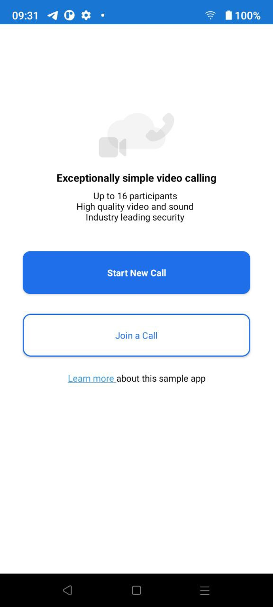 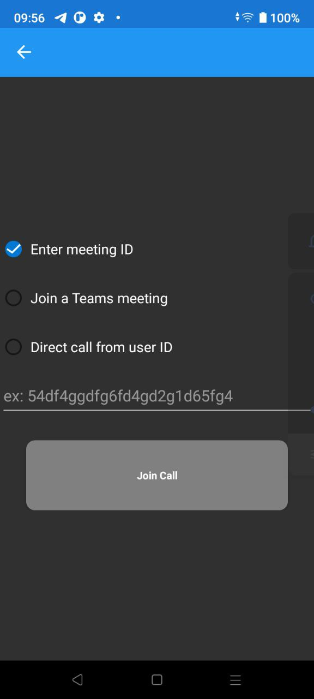  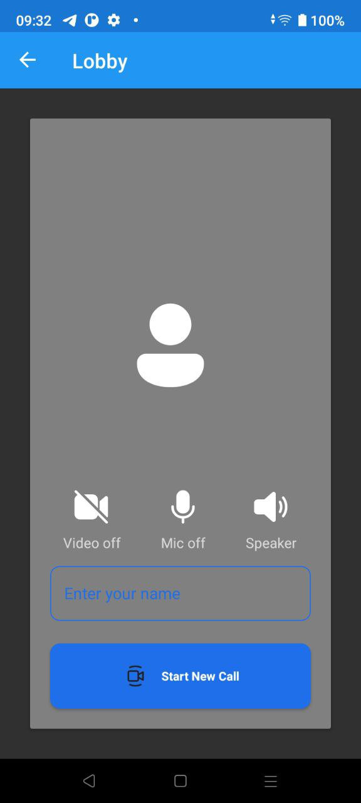  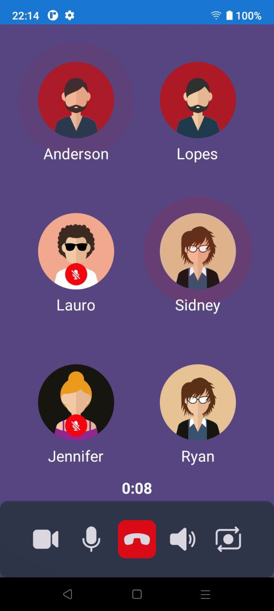

## iOS
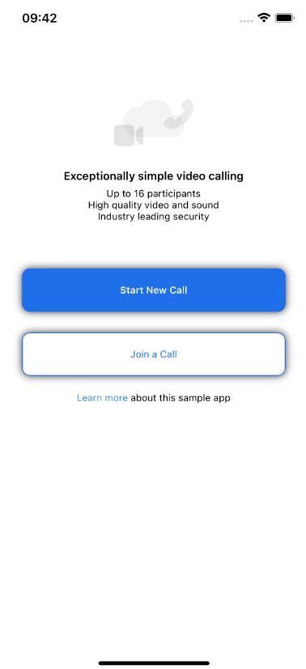  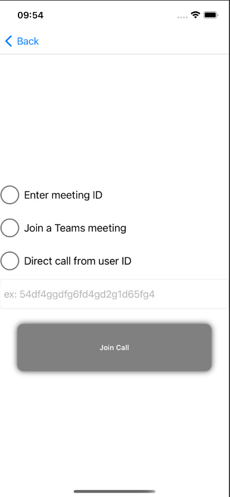  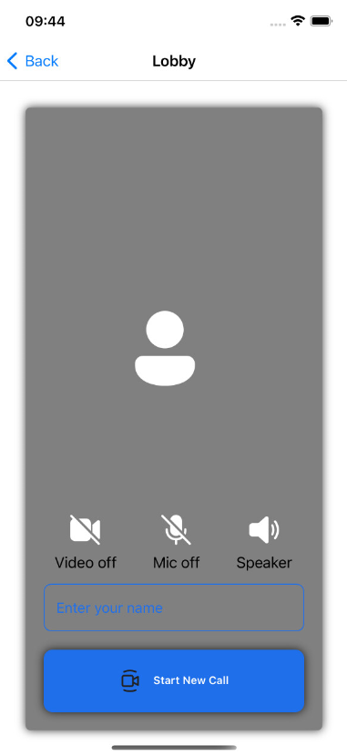  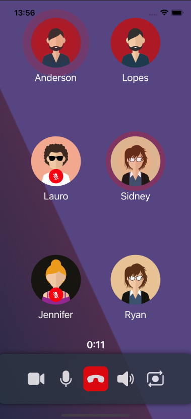
## UWP

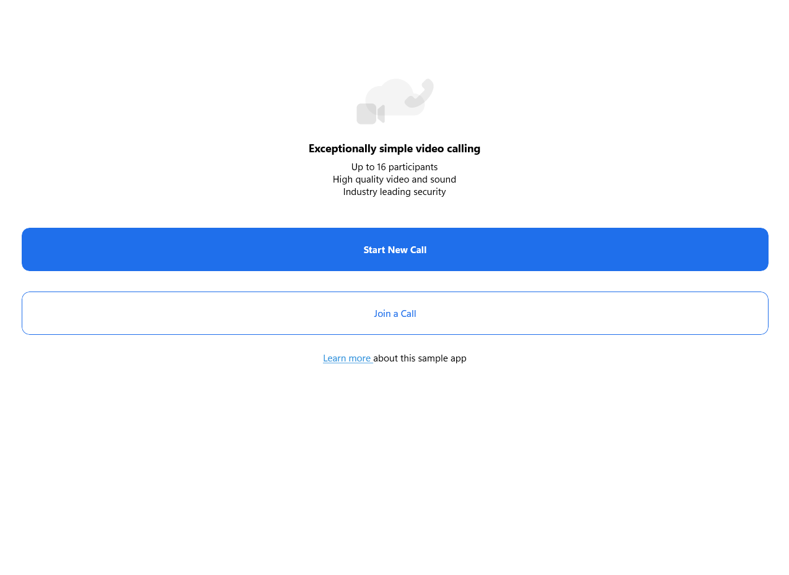  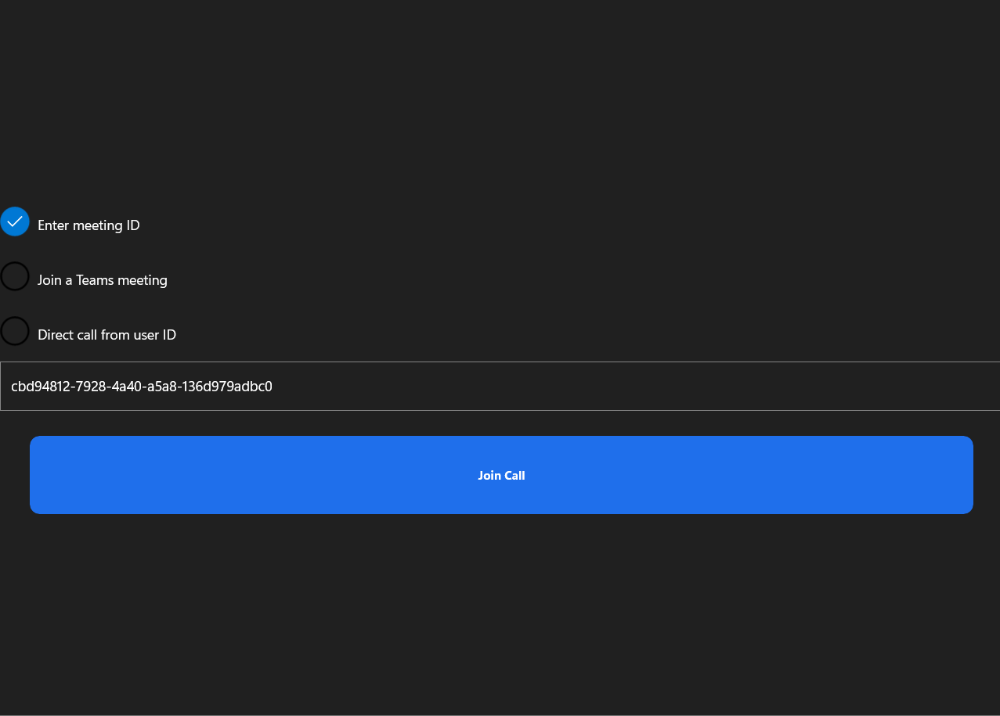 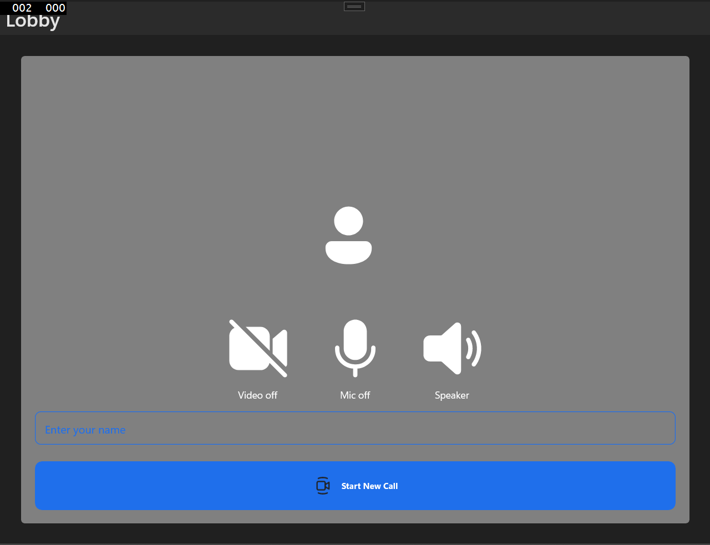  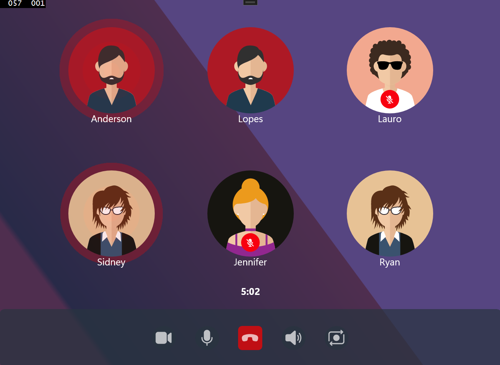

## Support Libraries

Mobile support is maintained by [@tompi](https://github.com/tompi)

Windows support is official.

# Features

| Features                                | iOS | Android |UWP |
| -----------------------------           | ----------- | --------------- | --------------- |
| Start or join in existing group call                  | ✅          |✅                 |✅        |
| Start a new PSTN call                   | ✅           | ✅               |✅               |
| Join an existing Teams Meeting          | ✅           | ✅               | ✅               |
| Start calls inside sdk                            | ✅             | ✅               |✅                |
| Receive calls inside sdk                             | ✅          | ✅               | ✅             |
| Add participants during calls                   | ✅         | ✅            | ✅           |
| Remove participants during calls                   | :x:         | :x:            | :x:           |
| call notification                             | :x:          | ✅               | ✅            |
| answer calls with locked screen               | :construction:          | :hourglass:               | :x:         |
| Switch layout between different call cases: only-local video view, one-on-one call view and group call with multiple participants                             | ✅             | ✅               |✅               |
| Render remote participant video streams dynamically | ✅             | ✅               |✅               |
| Show remote call participants                     | ✅             | ✅               |✅               |
| Show remote participants with microphone on/off   | ✅            | ✅               |✅               |
| Turning local video stream from camera on/off | ✅           | ✅               |✅               |
| switch between cameras                         | ✅            | ✅               |:x:                 |
| View remote screen sharing                     | :construction:            | :construction:                |:construction:                 |
| Request permission to use audio and/or video   | ✅             | ✅               |✅               |
| Mute/unmute local microphone audio      | ✅           | ✅               |✅               |
| Mute/unmute local speaker audio      | :x:           | :x:               |:x:               |
| Call in Hold      | :x:           | :x:               |:x:               |
| Show dominant speaker                         | ✅             | ✅                 |✅                 |
| Turn off screen on calls      | :hourglass:           | :hourglass:                |:x:               |
| Toggle audio output                       | ✅           | ✅               |:x:               |
| Sharing Audio                | :x:              |:x:           |:x:
| Screensharing                 | ✅               |✅           |:construction:
| Background Voip API           | ✅  Services              |:construction:  Callkit           |:x:  VoipPhoneCall 
## Subtitle

in progress      :construction: 

In consideration :hourglass:

Not implemented  :x:

implemented      ✅   

## Prerequisites

- An Azure account with an active subscription. [Create an account for free](https://azure.microsoft.com/free/?WT.mc_id=A261C142F).
- An OS running [Visual Studio 2022](https://visualstudio.microsoft.com/pt-br/vs/).
- A deployed Communication Services resource. [Create a Communication Services resource](https://docs.microsoft.com/azure/communication-services/quickstarts/create-communication-resource).
- An Authentication Endpoint that will return the Azure Communication Services Token. See [example](https://docs.microsoft.com/azure/communication-services/tutorials/trusted-service-tutorial)

## Run Sample

1. Build/Run in Visual Studio 2022

## Securing Authentication Endpoint

For simple demonstration purposes, this sample uses a publicly accessible endpoint by default to fetch an Azure Communication token. For production scenarios, it is recommended that the Azure Communication token is returned from a secured endpoint.  

## Required Libraries

- [Azure Communication Calling SDK Windows](https://www.nuget.org/packages/Azure.Communication.Calling)

- [Azure Communication Calling SDK Android](https://www.nuget.org/packages/Xamarin.AzureCommunicationCalling.Android)

- [Azure Communication Calling SDK Android Helper](https://www.nuget.org/packages/Xamarin.AzureCommunicationCallingHelper.Android)

- [Azure Communication Calling SDK Android Common](https://www.nuget.org/packages/Xamarin.AzureCommunicationCommon.Android)

- (No required) [Azure Communication Calling SDK Android Azure Core Logging](https://www.nuget.org/packages/Xamarin.AzureCoreLogging.Android)

- [Azure Communication Calling SDK iOS](https://www.nuget.org/packages/Xamarin.AzureCommunicationCalling.iOS)

# Known issues in the xamarin example

## Android

There is some privacy policy on the camera, as it only works if the user can see their own image on the screen, it is a point of attention.

## UWP

The token initialization agent has a wait of up to 15 seconds

Incoming call and accept/or reject status does not update on event.

Video refresh event no longer works after a video is removed from the screen.

Call events in windows are unstable in certain scenarios and suddenly stop working.

Please refer to the [wiki](https://github.com/Azure-Samples/communication-services-android-calling-hero/wiki/Known-Issues) for known issues related to this sample.
](https://docs.microsoft.com/en-us/azure/communication-services/concepts/voice-video-calling/calling-sdk-features)

