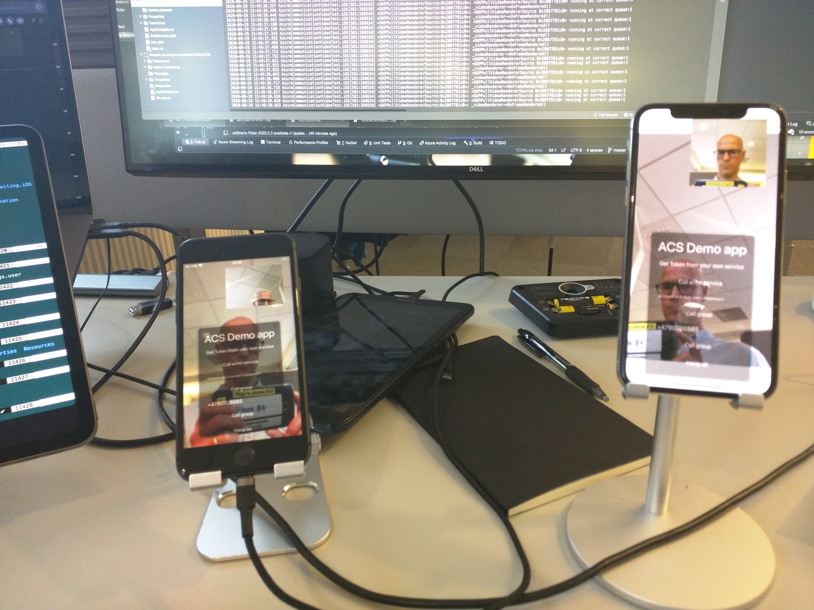

iOS binding library for project spool
=====================================

Use this library to make spool calls(AzureCommunicationCalling).

The native package is so big(120MB) that github wont accept it in a regular repo,
so you need to install LFS to get all the files:

https://docs.github.com/en/github/managing-large-files/installing-git-large-file-storage

See the sample forms app for usage. You need to implement the rest service providing the ACS token, afterwards the app should look like this:

